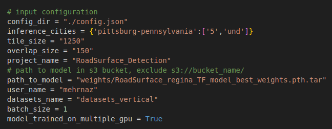

# SD Mapping Inference_s3 Module
The inference_s3 code is an stand alone code to run inference fro RoadSurface/LaneMarker_solids (either on local machine or on Ec2) while **data is located on s3 bucket** and result of inference (rasters.pkl) will be witten on s3 bucket.


## Environment
The environemt for is a poetry environment. <br>
Activate the environment first navigate to project folder and then activate the invironment:
```bash
  cd inferene_s3
  poetry shell
```
## Usage : 
The main file to run is inference.py. 


### Input Configuration
Some configuration of inputs should be performed wihtin the inference.py in __main__ scope for each city that we want to run inference on.
> List of required configurations are as follows:

> **config_dir =  <"path/to/config.json">** &nbsp;&nbsp;&nbsp;This path is inside code folder, is fixed and you do not to change it <br>
> **inference_cities = {'pittsburg-pennsylvania':['5','und']}** &nbsp;&nbsp;&nbsp;A dictionary for list of cities you want to perform inferecne on. <br>
> **tile_size = "1250"** &nbsp;&nbsp;&nbsp;It is fixed donot need to be change. <br>
> **overlap_size = "150"** &nbsp;&nbsp;&nbsp;It is fixed donot need to be changed. <br>
> **project_name = "RoadSurface_Detection" or "RoudSurface_Detection"** <br>
> **path_to_model = "path/to/weights.pth.tar"** &nbsp;&nbsp;&nbsp;you should change it if you have new RoadSurface/LaneMarker_Solids model. <br>
> **user_name = <"user_name">** &nbsp;&nbsp;&nbsp;it is name of the person running the code! <br>
> **datasets_name = "datasets_vertical"** &nbsp;&nbsp;&nbsp;datasets folder name <br>
> **batch_size = 1** &nbsp;&nbsp;&nbsp;Batch size can be increased if your have a machine with a high-capacity memeory <br>
> **model_trained_on_multiple_gpu = True** &nbsp;&nbsp;&nbsp;keep this value always as True even if your model is train on a single GPU <br>

 The Following Image Shows an Example of Configuration Setting: <br>



### Running Inference 
After setting up the configuration,you can run the inference.py and in result a **rasters.pkl** file will be generated in the output_dir:<br>
> **ouput_dir =** <s3://bucket_name/datasets_name/city-name/inference/month/project_name/percent/1250_150/user_name/date/time/outputs/rasters.pkl> <br>


Example of output_dir = "s3://geomate-data-repo-dev/datasets_vertical/pittsburg-pennsylvania/inference/und/RoadSurface_Detection/5_percent/1250_150/mehrnaz/2024_12_03/09_49/outputs/rasters.pkl"

```bash
# not to get credintial error first have aws configure sso set up and then run the following
 export AWS_PROFILE=PowerUserAccess-691506669376 
 
 python inference.py
```
### After Inference:
After generating the **rasters.pkl** file one should run post-processing to generate **.geojson** file form the rasters file. <br>

Please check the post-porocess module for this purpose. 


